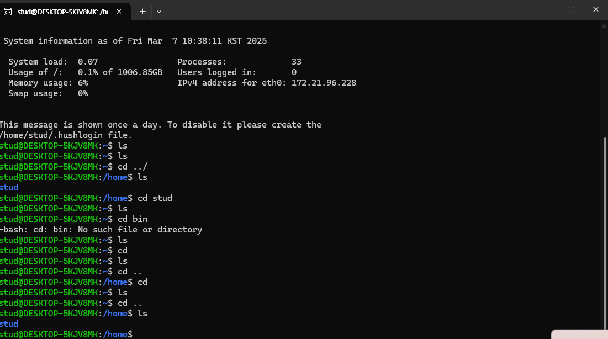

# 1주차 0307

## wsl2를 설치 후 프롬프트 ls 명령하기

## 필기 

리눅스를 돌릴 수 있도록 하는 세가지

usb나 하드를 이용해서 리눅스를 설치

가상머신 설치하고 우분투 설치

WSL사용 WSL2 - 윈도우에서 

라즈베리5 구입하여 리눅스사

서버구축할 때 리눅스로 사용함, 하드에 리눅스를 설치하는걸 권장

[https://rimiyeyo.tistory.com/entry/WSL2개념과-Windows에서-WSL2를-활용해서-Linux사용해보기](https://rimiyeyo.tistory.com/entry/WSL2%EA%B0%9C%EB%85%90%EA%B3%BC-Windows%EC%97%90%EC%84%9C-WSL2%EB%A5%BC-%ED%99%9C%EC%9A%A9%ED%95%B4%EC%84%9C-Linux%EC%82%AC%EC%9A%A9%ED%95%B4%EB%B3%B4%EA%B8%B0)

powershell은 리눅스 명령어를 사용함 →사용자들이 잘 안씀 →cmd와 병행하여 사용

wsl2를 설치 후 프롬프트 ls명령 치면 쭊 나

정보지식을 얻기 위한 방법 순서

사람- 책- 검색- 대화
