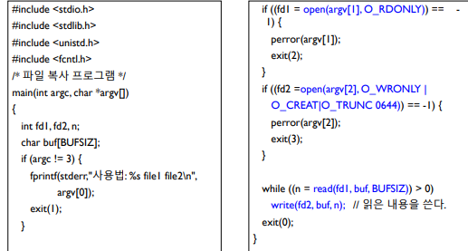

## 10주차

### HW

### 필기

# 10주차 0509

강의자료 시스템프로그래밍05

copy.c 작성

파일 디스크립터 복제

dup.c

dup로 copy도 가능해보임

파일 위치 포인터

lseek()

rw권한가지면 내 파일

student.h

dbcreate.c

dbquery.c

dbupdate.c

student.h 실행

전부 실행하고 레코드넣어보고 쿼리할줄 알아야함

_____

pdf 06

컴퓨터 시스템 구조

시스템 호출

pdf 07

파일 시스템 구조

부트시 rom이 하는것

부트블록

슈퍼블록

i-리스트 

데이터블록

i-노드

블록 포인터

4k * 10 + 1024 * 4k + 1024^2 * 4k = 40kb + 4MB + 4GB

파일 입출력 구현

파일을 위한 커널 자료구조

파일 디스크립터 배열(Fd Array)

열린 파일 테이블(Open File Table)

동적 i-노드 테이블(Active i-node Table)

파일을 위한 커널 자료구조

파일 상태(file status)

상태 정보 : stat()

stat 구조체

ftype.c

파일 사용권한

사용권한

st_mode의 값

chmod(), fchmod()

chown()

utime()

디렉토리구현

파일 이름/크기 출력

list2.c
