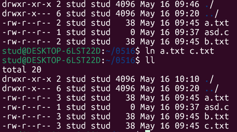

# 11주차 0516

# 필기

stat 구조

깃허브 레포지토리 15점

레포트 15점

50개 명령어 만들고 설명 할 줄 알아야함

파일타입

파일접근권한

과제

팁 - 주석달면서 하기

getopt getoptlong  이걸이용하면 원하는 옵션을 선택할수있

구현하는건 지피티에 ‘리눅스에서 ls 명령을 C로 구현해줘’ 

명령만드는거도 ㄱㄴ

chmod fchmod

자료엔 넣는방법은없음 getopt optlong으로 넣기

utime

터치명령구현

touch.c

~

list1.c

파일이름과 크기출력

st_mode

저번주 main type printstat perm 함

디렉토리생성

삭제

구현

모든 디렉토리를 만들떈 무조건 . ..생성됨

링크와 카피가 다른 점

**파일의 실제 내용을 복사해서 새로운 파일을 생성**

**원본 파일을 참조하는 방식**

심볼릭링크 

하드링크

2 → 3        링크가 걸려있음

unlink

________________

### chap7

파일 레코드잠금

파일잠금 flock 

레코드잠금 fcntl

권고잠금 강제잠금

권고 - 잠금할수 있지만 강제안함

_______________
### chap8

쉘

복합명령어

전면처리 후면처리

프로세스

kill

wait

exit

프로그램 실행 시작

exec 시스템 호출

c 시작 루틴

명령줄 인수/환경 변수

프로그램 종료 

 _exit()

atexit exit처리기

프로세스id 

각 프로세스는 생성해준 부모 프로세스가 있음

pid.c

프로세스의 사용자 ID

실제 사용자 ID(real user ID)

유효 사용자 ID(effective user ID)

set-user-id 실행권한

이게 설정된 파일은 프로세스가 실행되는 중 사용자id가 소유자권한 얻음

리눅스에서의 최상위프로세서

init systemd

pid 1
_______________
### chap9

프로세스 생성

부모프로세스가 자식프로세스 생성

fork 시스템 호출

### 과제 안내 

마지막주 할일 6.13까지

5월30일까지 깃허브정리한 ppt있어야함

깃허브정리 readme.md

운영체제에 들어가는 명령어를 구현 할 수 있음

시스템호출로가능하고 자료구조를 파악하면됨

교재의 소스코드 가능 

지피티쓰셈 

설명할수있어야함(주석다셈)

ls에서 하나만 되는게아니고 추가로 가능할거임 getopt같은걸로

깃허브에 제출되야함
