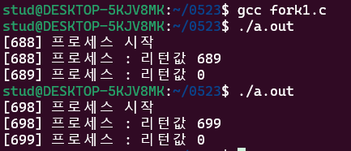

# 필기

## 12주차 0523

6/20일 기말고사

ppt하나나 두개만들기

레포지토리 디렉토리랑 readme있는지, 깃허브 히스토리 캡쳐하기

과제 명령어 구현하기 - 

6월13일에 발표 시간은 3분이내

깃허브 15점 + 과제15점해서

내 점수 정리해서 발표, 발표시간 짧게

프로세스 fork() - 자기복제

fork다음의 명령들을 실행함

나 자신을 실행하고 복제도 실행함

_________________

오류뜨면 get man해서 라이브러리 참고하기

exit(0)쓰는이유  재귀적으로 코드가 실행

wait() - 자식프로세스중 하나가 끝날 때 까지 기다림.

 

_____________

발표 - 효율적 소인수분해 알고리즘 (최우석)

연구동기

rsa암호화방식 - 소인수분해 기반 공개키 암호화방식

n을 큰수로 설정하면 높은 보안수준

2,301,883,971,777,917 = 39487603 x 58293839

<2^64

확률적 소수판별 알고리즘 - 페르마의 소정리 이용

소수판별법

사이클 탐지 기반 확률적 인수분해 알고리즘

큰합성수의 약수찾기 

생일문제 n개의 가능한 값중 두값이 같아질 확률이 50% 이상일 경우는?  m≥ \sqrt {2n ln2}

pollard’s rho algorithm

효율적소수
