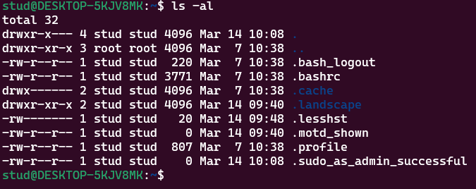

# 2주차 0314

유닉스 GNU

설계철학

단순성 이식성 개방성

유닉스 특징

다중사용자, 다중프로세스

쉘프로그래밍  쉘 - 명령어 해독기

훌륭한 네트워킹

유닉스 구조

OS

사용자 및 하드웨어 자원을 운영 관리함

커널

운영체제 핵심

시스템호출

운영체제에 있는걸 갖다 씀. 

쉘

명령어 해석기 ex) cmd, powershell

커널 

프로세스 관리   파일 관리   메모리 관리

통신관리   주변장치 관리

c언어로 작성됨

오픈소스

리눅스

솔라리스

맥os 

안드로이드

ios

운영체제의 표준은 유닉스

2장 생략

우분투

gedit

사용자가 작업할 때,

사용자는 항상 특정한 디렉토리에서 작업을 한다  

= 명령을 내린다.

화면을 켜면 바탕하면 디렉토리에서 사용함(desktop)

pwd 현재 디렉토리 위치

info pwd  - q로 탈출

pwd —help

man  - 메뉴얼

리눅스 시스템 디렉토리

sudo apt install tree    tree명령어를 실행하기위해 설치

tree

디렉토리란

서로 연관성이 있는 파일과 디렉토리를 모아둔 곳

포맷하면 하드디스크는 루트디렉토리가 됨

운영체제가 디렉토리 설정 후 파일 설치

/home  /bin   /usr

파일 - 실행파일, 데이터파일

/   - 루트 디렉토리

~  - 홈 디렉토리

.    - 자기 자신에 대한 정보

..   - 부모에 대한 정보

pwd  - 현재 디렉토리

cd   - 디렉토리 이동

mkdir  - 디렉토리 만들기

/_home_stud_software       

절대경로    cd /home/stud/software      루트부터 표기하는거

상대경로    cd ..    cd ./software    cd software     내가 작업하는 곳을 기준으로

cat > _    파일만들기      ctrl+d 로 종료 

cat _ 파일보기

path    path에 설정해두면 어느 디렉토리에서도 파일 실행가능

윈도우의 환경변수 Path와 같은역

software - sysem - os

                 - le - compiler       a.txt

                      - interpreter    b.txt

                 - util                c.txt        (.txt개념은 윈도우에만)

          - app                        d.txt

위를 만드는 방법

현재 software

mkdir system

mkdir system / os

mkdir을 사용해서 파일 만들기 해보세요

위의 abcd만들면서 구조를 트리로 만들기
