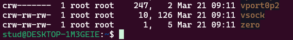

# 3주차 강의

## 미션

학번과 이름을 입력받아 화면에 출력하는 c프로그램 작성 후 테스트 한 결과 화면을 캡쳐해 톡에 업로드

# 필기

## 3주차 0321

운영체제의 역할

사용자와 하드웨어를 연결시켜줌

인터페이스 역할을 한다.

컴퓨터의 자원을 다루기 위해서 기본적으로 제공되는 명령들

어떠한 파일들도 디렉토리에 포함된다

파일의 위치를 표현할 때 path

실행 파일의 경로를 설정할 때 path

파일명은 유니크함

cd md rd

상대경로 

. 자신에 대한 정보

.. 부모에 대한 정보

__________________________

리눅스 설치 - apt

/ : root 

. : self

.. : parent

~ : home

패스워드 변경 : passwd

wsl을 이용중인데 gpt한테 암호 잃어버렷다고 질문

사람 - 책 - 검색 - 대화 

화면정리 clear

man - 온라인 매뉴얼

gui

ㅈㄴ잠온다 하 시부럴거

whatis - 명령어 간단 설명

나중에 ls명령 구현할 것

whatis ls 할 때 나오는 ls(1) 숫자의 의미 

1 사용자명령어

2 시스템 호출

3 라이브러리 함수

4 장치 파일 및 드라이버

5 파일 포맷

6 게임

파일 종류

일반파일

디렉토리 / 폴더

장치파일 

심볼릭 링크 파일

ll /

ll /dev

파일의 종류       - - - - 

디렉토리 계층구조

홈 디렉토리

경로명     

which - 명령어의 경로 확인     

ls /usr/bin/l* - l로 시작하는거 (* - all, ? - one)       ls /usr/bin/?? - 두글자로 이루어진 거

pwd - 현재 작업 디렉토리 출력   print working directory

cd - 디렉토리 이동

mkdir - 디렉토리 생성

rmdir - 디렉토리 삭제      빈 디렉토리만 삭제 가능

rm -r 디렉토리와 안의 모든 파일을 삭제 (r - recursive)

ls - 디렉토리 리스트

깃허브 사용법

깃 깃허브 연동

우분투에 명령 ssh-keygen

깃설치, 아이디등록, 이메일등록 

git add            git commit -m            git push

깃 

병렬개발    분산버전관리    체계적

init status   add   commit

__________________

touch - 빈 파일 만들기       타임 스탬프 적기 기능          touch hello.c

cat >

sudo 

ls 파일의 정보  cat 파일의 내용

cat  more  head  tail  wc

wc  라인수  단어수  문자수  파일이름

gcc 하면

a.out이 만들어짐 ←실행파일

./ ~~ 실행

code . 하면 vscode 실행됨

vscode, 깃허브, 윈도우탐색기 에서 확인 가능

파일 탐색기에서  \\wsl$ 입력하면  우분투 파일 확인 가능

\\wsl.localhost\Ubuntu-24.04\home\stud\0321  

__________________

4장 처음부터 

0321 미션

학번과 이름을 입력받아 화면에 출력하는 c프로그램 작성 후 테스트 한 결과 화면을 캡쳐해 톡에 업로드

\

깃허브 시간준수할건 미션, 레포트, 파일   단, 마크다운은 재설정 가능
