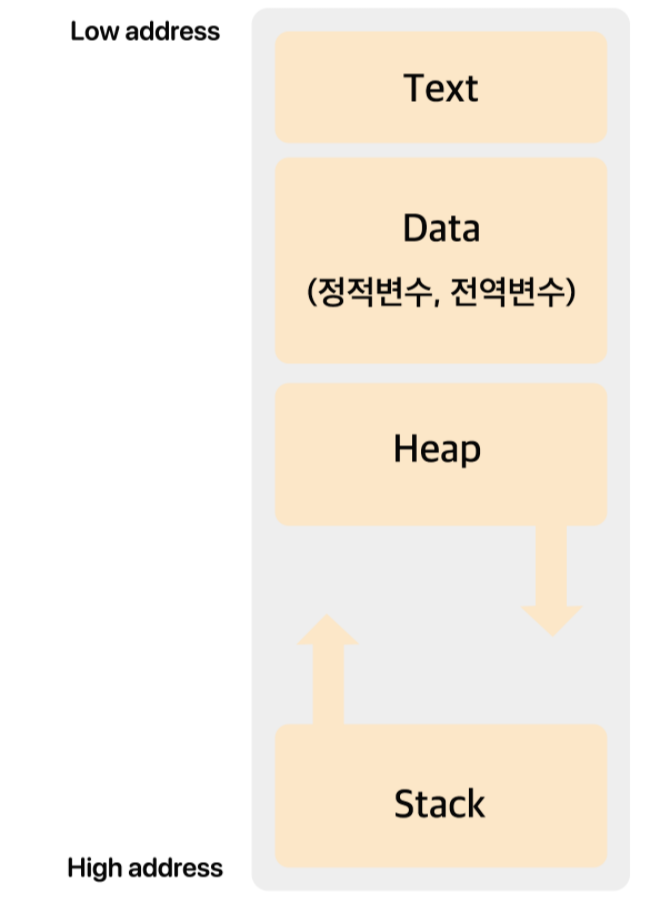

# 4주차  

# 미션

대문자를 입력받고 소문자로 출력하고, 소문자를 입력받고 대문자를 출력하는 프로그램을 작성하시오.

# 4주차 0328

빅데이터센터 - 교육및 세미나 - 데이터 • AI 활용 역량강화과정   ****다음주 할 예정

## 변수

## 연산자

단항연산자 - operand가 한개 (a)++               operator

2항연산자 - 오퍼랜드 2개      a+b

조건연산자 - 오퍼랜드 3개    a?b:c

산술

시프트

관계

비교

비트

논리

할당

콤마

캐스트연산자  자료형을 바꿈

## 제어문

if  switch

for  while  do while

break  continue  

return

goto  <단방향으로 쓸 것 - 분석이 힘들어짐(스파게티코드)

return 0

숫자 0은 정상적인 종료를 의미

0를 운영체제에 return

메타인지 - 내가 무엇을 알고 있는지 알고 있는것

## 함수

인풋 parameter 매개변수

아웃풋 argument 인자

출력 리턴뒤의 수식

## 코드집합

변수, =, 제어문, 함수

var = expression

coustant

variable

operator

function

_________

## 배열

동일한 데이터타입의 연속적인 메모리공간

인덱스를 염두해야함

for문을 이용하여 접근

## 포인터

&x ←주소연산자             x&x 비트and     && 논리and

&, * 포인터 변수 - 숫자대입안되고 주소만 들어감

배열 이름에는 배열의 시작 주소가 있음

## c언어 메모리 구조

실행할때 메모리잡는게 동적할당 힙
객체가 만들어지는 영역 힙
변수가 만들어지는 영역 스택
정적변수 전역변수

## 구조체

다른 데이터타입을 하나의 단위로 묶는 사용자정의 데이터타

## 페이지 단위로 파일 내용 보기: more

## 파일복사 cp

-r 전체복사

## 파일이동: mv

## 파일 삭제: rm

-r 전체삭

## 링크

기존 파일에 대한 또 하나의 새로운 이름
카피와 링크의 차이

하드링크

## 파일 속성(file attribute)

drwxr-xr-x 2 stud stud  4096 Mar 28 10:29

블록 수, 파일 종류, 접근권한, 링크 수, 소유자 및 그룹, 수정 시간

drwxr-xr-x       d/ rwx/ r-x/ r-x

맨 앞자리는 파일의 종류 

d-디렉토리   - - 일반파일    l - 링크

내가 속한 그룹의 사람들은

rwx   read write excute가능함

그룹권한

r-x     읽고 실행만 가능함

2는 하드링크 수

리눅스는 연결된 모든 디바이스를 파일로 읽고 처리함

리눅스는 의 파일속성을통해 x가 있으면 실행파일이다

윈도우는 .exe

도스에서 리눅스를 베끼면서 확장자 개념을 가져옴

## 접근권한(permission mode)

파일에 대한 읽기(r), 쓰기(w), 실행(x) 권한

 chmod(change mode)

8진수

rwx - 7  →  111 - 7

## 접근권한 표현: 기호

기호를 이용한 접근권한 변경

$ chmod g-w cs1.txt  - 그룹에서 쓰기권한 빼기

$ chmod g+w,o+rw cs1.txt  - 그룹에서 쓰기 권한더하고 기타에 읽기쓰기 더함

## 소유자변경

## 그룹변경
