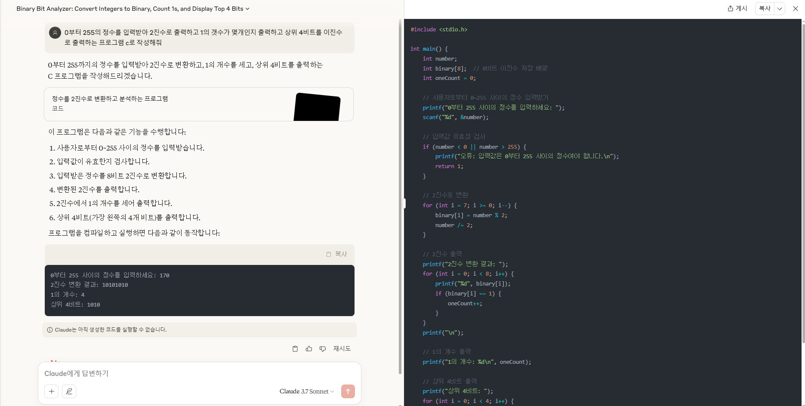

# 5주차

## 미션

0부터 255의 정수를 입력받아 2진수로 출력하고 1의 갯수가 몇개인지 출력하는 프로그램 작성

상위 4비트를 이진수로 출력하는 프로그램 작성

# 필기

자료실 1. 인공지능의 이해

사람과 인공지능은 거의 구분 될 수 없다

dx   digital trasformation

ax    ai trasformation

대우건설은 10명이 3개월걸리는 입찰문서분석을 인공지능을 이요하여 하루만에 해결

2.ppt

제로샷 원샷 퓨샷 << 예시를 1개, 2개 주는거

____

2차시

1. 4.  5.

chatgpt

gemini

책 - 만들면서 배우는 생성형 ai 첫걸음

클로드에 주제던지고

뤼튼으로 이미지생성

ms디자이너 템플릿

직접검증하면서 사고를 넓히기

___
