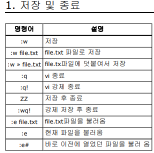

# 6주차 0411

## 필기

vi 편집기

a - 편집모드

esc - 편집모드 → 명령모드

:  - 명령모드 → 실행모드

:w - 저장

vi hello.c 진입

:!gcc hello hello.c

! ← :뒤에 사용해서 외부 명령어 가능

; → 앞에거 먼저 실행하고 다음꺼 실행(명령어 동시 실행)

실행시킬려면 실행가능한 파일로 바꿔줘야됨 chmod o+x test1

___

쉘 프로그래밍

echo 내가 원하는 문자열을 출력

실행권한 부여하기

set - 환경변수

백틱 backtick ( ` )

수치계산 주의

scale 소숫점 자릿수

___

IF문

x - 패스워드 필드

암호화 알고리즘 - SHA224 SHA384 SHA512

nested if문

val1=testing
val2=‘’

언어마다 널일수도 아닐수도 있다

for문

__

## 쉘

 Bash(Bourne again shell)  — 리눅스에서 사용
 GNU에서 본 쉘을 확장하여 개발한 쉘

명령어 처리
- 사용자가 입력한 명령을 해석하고 적절한 프로그램을 실행
시작 파일
- 로그인할 때 실행되어 사용자별로 맞춤형 사용 환경 설정
스크립트
- 쉘 자체 내의 프로그래밍 기능

환경변수 설정

시작할 때 시작파일들이 모두 실행됨

전면처리 후면처리

표준 입출력 장치

파이프

여러개의 명령어

조건명령어

파일이름대치

