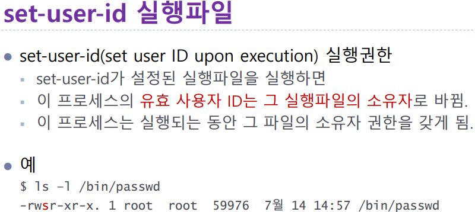

# 7주차 0418

## 필기 
chap06

## 프로세스

실행중인 프로그램

부모프로세스

시스템프로세스 사용자프로세스

ps 프로세스상태보기

pgrep 특정 프로세스 리스트

## 작업제어

~~

fg 후면작업 전면전환 - 정지된 작업을 전면에서 다시실행

bg %id  전면작업 후면전환 - 해당 중지된 작업을 후면작업으로 전환해 실행

## 프로세스 사용자 ID

실제 사용자 ID

유효 사용자 ID

## 시그널과 프로세스

chap07

## 네트워크 구성

랜 

라우터

게이트웨이

## 인터넷

호스트명

## 서버설치

웹서버

ftp 서버 설치

## 파일전송

## 원격접속

______________

chap08

## 파일 속성으로 파일 찾기

find

## 파일 필터링

grep

정규식

## 파일 정렬

## 파일 비교

cmp ~ ~  파일1과 파일2가 같은지 비교한다

정렬하는이유 검색하기위해서

diff

## 기타 파일 조작

spilt

chap 09 유틸리티

## 명령어 스케줄링

 cron 스케쥴링 시스템,  명시된대로 주기적으로 명령수행함

crontab   

## 디스크 및 아카이브

df

tar 아카이브

## 파일압축

gzip 압축

compress

## AWK
AWK 프로그램 작성

chap10

## bash 쉘

cat bashrc

## 별명 히스토리기능

alias 새로운 이름을 별명으로 정의

history 

## 변수

## 지역변수 환경변수

## bash 쉘 스크립트

if 문 

## 수식 조건문 반복

__________________

chap11

## 프로그램 작성과 컴파일

gedit

다중모듈프로그램:예

main과 copy함수를 분리해서 별도파일로 작성

## 자동 빌드 도구

make 시스템 필요성
